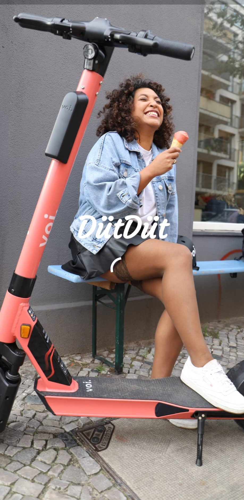
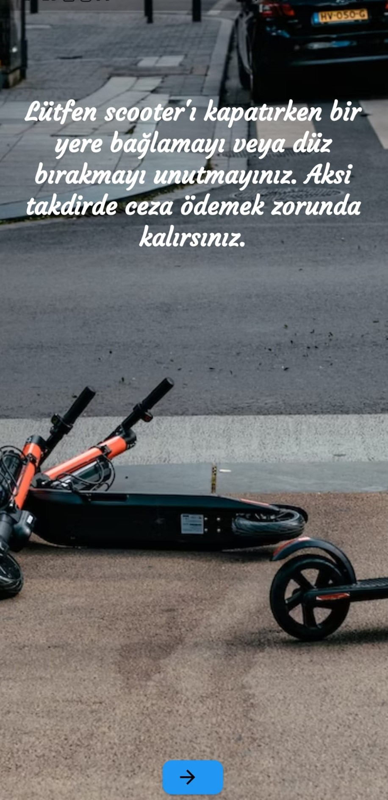
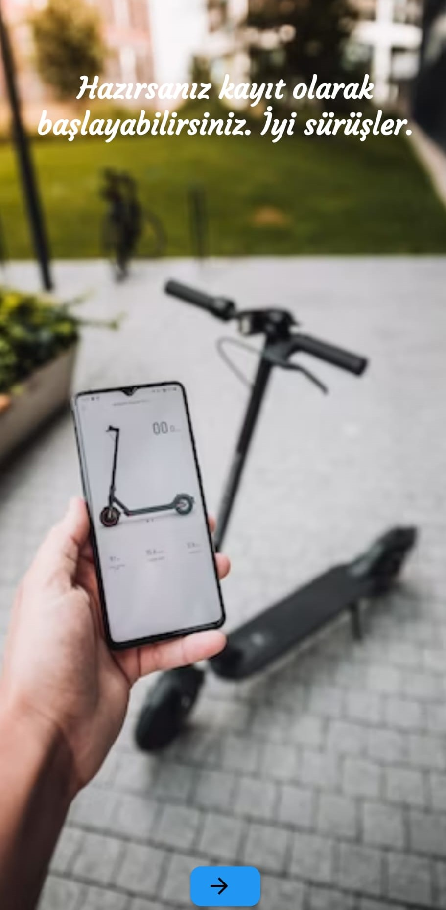
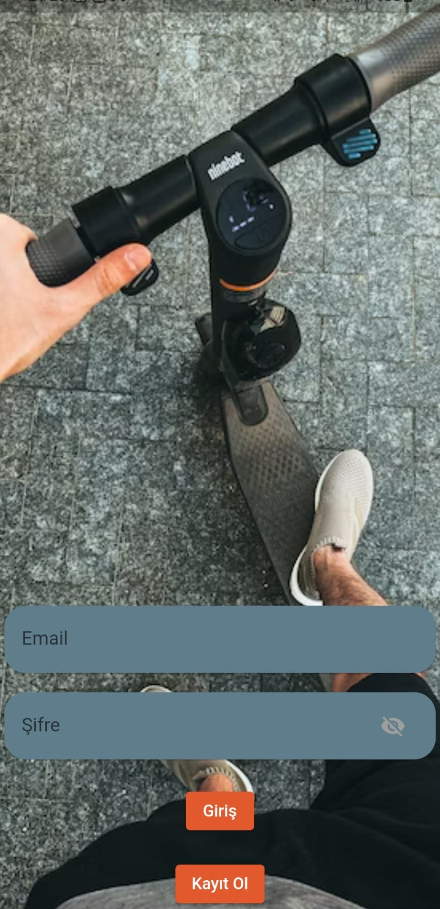
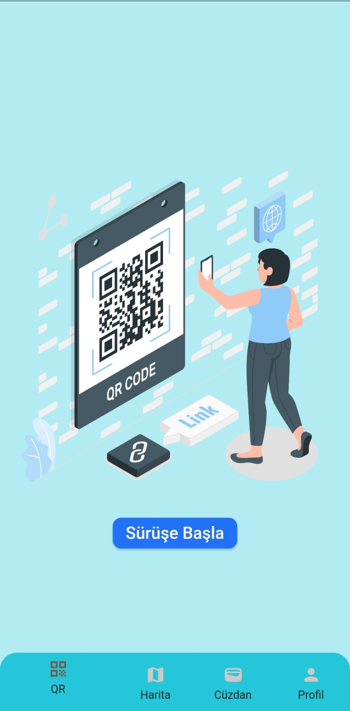
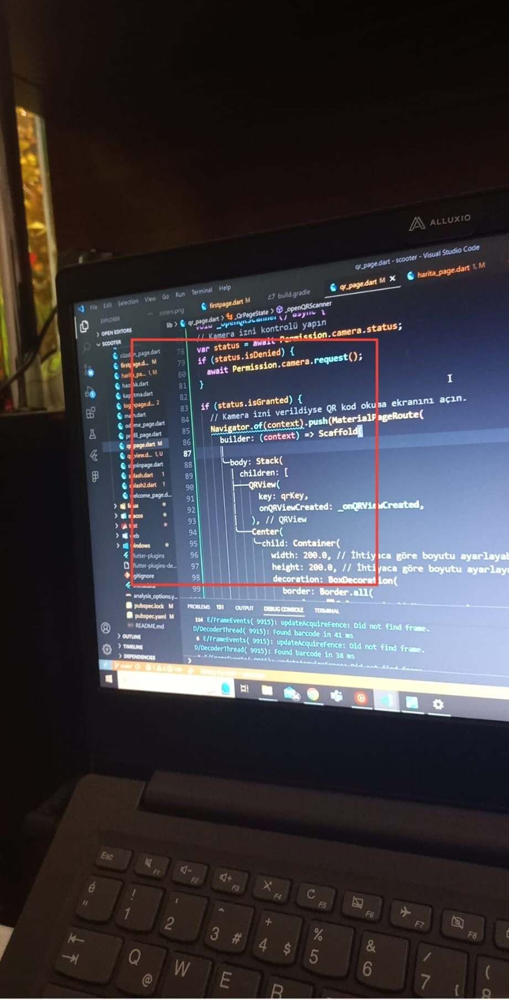
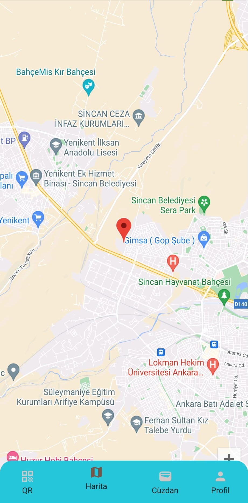
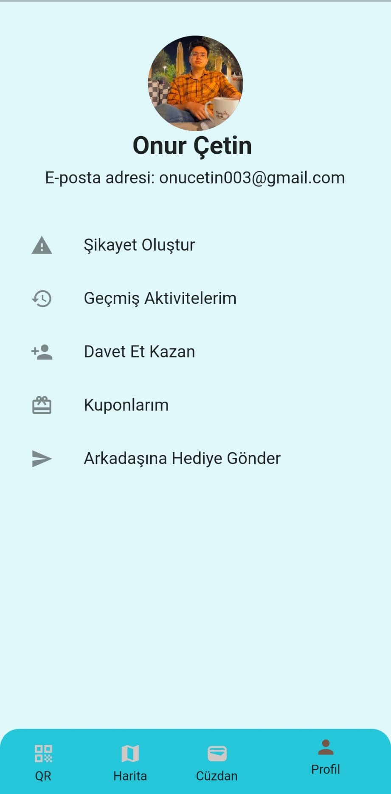

# Scooter App 

Örnek bir scooter kiralama uygulaması

## Ekran Görüntüleri

## Screenshots

- Splash Screen and Warning Cards

|                   0000                    |                   0001                   |                   0010                   |                       0011                        |
|:-----------------------------------------:|:----------------------------------------:|:----------------------------------------:|:-------------------------------------------------:|
|  |  |  |  |

- Start Page, Log In Page ,Splash and Main Page

|                   0000                    |                   0001                   |                  0010                   |                      0011                      |
|:-----------------------------------------------:|:-----------------------------------------:|:--------------------------------------:|:------------------------------------------------:|
|  |  |  |  |

- QR and QR View ,Map-Location Page, Wallet And Profile Page

|                   0000                    |                   0001                   |                  0010                   |                      0011                      |
|:-----------------------------------------------:|:-----------------------------------------:|:--------------------------------------:|:------------------------------------------------:|
|  |  |  |  |

  
## Kullanılanlar ve Paketler

- Google Cloud Service
- https://storyset.com/
- https://unsplash.com/
- google_maps_flutter: ^2.0.10
- location: ^5.0.0
- map_launcher: ^2.5.0+1
- flutter_map_location_marker: ^6.0.0
- qr_code_scanner: ^1.0.1
- permission_handler: ^10.4.3

  
